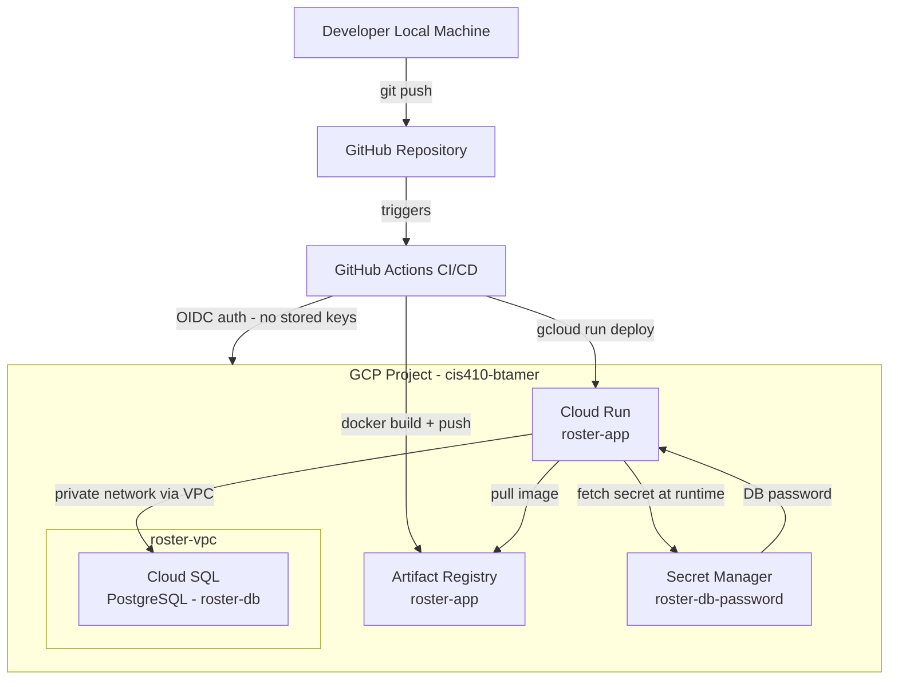
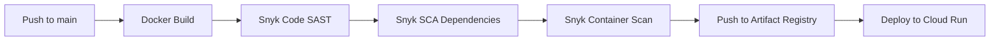

# Roster — Architecture Diagram

## System Architecture

## Component Descriptions

| Component | Technology | Purpose |
|---|---|---|
| Frontend | Flask templates | Shift listing and claiming UI |
| Backend | Python Flask on Cloud Run | REST API for shift management |
| Database | Cloud SQL PostgreSQL | Persistent shift and user data |
| Container Registry | Artifact Registry | Stores Docker images tagged by commit SHA |
| Secrets | Secret Manager | DB password — never in code or env files |
| Network | VPC roster-vpc | Private network connecting Cloud Run to Cloud SQL |
| CI/CD | GitHub Actions + OIDC | Build, scan, and deploy on every push to main |
| Security Scanning | Snyk SAST + SCA + Container | Runs on every pull request |

## CI/CD Pipeline Flow

